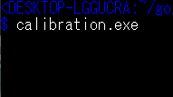

go-termgap
==========

The library [go-runewidth](https://github.com/mattn/go-runewidth) is very 
useful, but on the Windows command prompt,
rune's width sometimes differs from
[the unicode-standard](https://unicode.org/Public/12.1.0/ucd/EastAsianWidth.txt)
because a lot of fonts are used.

*go-termgap* makes the database of rune's width of your own terminal 
and give the API to reffer it.

Setup database
--------------

    go get github.com/zetamatta/go-termgap
    cd %USERPROFILE%\go\github.com/zetamatta/go-termgap/calibrate
    go build
    .\calibrate

For each unicode, calibrate.exe prints it with the format `"\r%c"` 
and reads the cursor position with GetConsoleScreenBufferInfo.

The database is saved on  `%USERPROFILE%\AppData\Local\nyaos_org\termgap.json`.

How to use in your code
-----------------------

    // +build run

    package main

    import (
        "fmt"
        "os"

        "github.com/zetamatta/go-termgap"
    )

    func main1() error {
        db, err := termgap.New()
        if err != nil {
            return err
        }
        w, err := db.RuneWidth('\u2727')
        if err != nil {
            return err
        }
        fmt.Printf("[\u2727]'s width=%d.\n", w)
        return nil
    }

    func main() {
        if err := main1(); err != nil {
            fmt.Fprintln(os.Stderr, err.Error())
            os.Exit(1)
        }
    }

When termgap.json is not found, use go-runewidth
------------------------------------------------

- When termgap.json exists, `hybrid.RuneWidth` creates a `termgap.Database` instance and calls its method RuneWidth.
- Otherwise it calls `runewidth.RuneWidth`

.

    // +build run

    package main

    import (
        "fmt"
        "github.com/zetamatta/go-termgap/hybrid"
    )

    func main() {
        fmt.Printf("[A]'s width=%d\n", hybrid.RuneWidth('A'))
        fmt.Printf("[\u2727]'s width=%d\n", hybrid.RuneWidth('\u2727'))
    }
